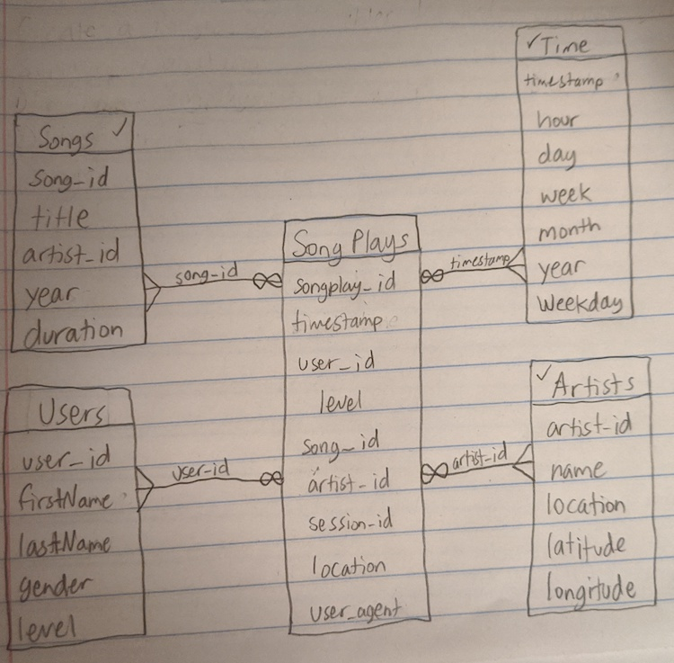

# Data Modelling with PostgreSQL 
This project was designed to show what I have learned on data modeling with Postgres. I built an ETL pipeline using Python, which takes in data from a collection of JSON files containing information about songs and a collection of CSV files that contain information about the user activity. I defined a fact and dimension tables using a star schema, I wrote an ETL pipeline that transfers data from files in two local directories and loads them into a single table in Postgres using Python and SQL.

# Motivation
Sparkify has been collecting data on user activity in relation to song consumption. The purpose of this database to to understand what songs the users are listening to. The goal was to optimize queries on song play analysis. This was acomplished using an ETL Pipeline that connected the data from the Songs/Artist song data with the User/Time logs data into a single database. 

# Database schema design and ETL pipeline
The schema used was a star schema. The benifit of this was that it allowed us to simplify the queries that the analytics team were looking for. The ETL Pipeline allowed us to merge two data sets, trasnform the data to drop the unnecessary columns and rows, and then load it into a PostgreSQL Database for data analytics.

# Source code description
1) There are two iPython Notebook files:
- etl.ipynb: This was used in the initial testing phase, so that I could get a feel for how to model the data. I worked with a single row of data at a time to simplify the process of development.
- test.ipynb: This was used to test SQL queries, once I had everything working on a single row
2) There are two Python files:
- etl.py: This contains the same source from etl.ipynb, but was designed to operate on the whole data set. It is modular and functional. This abstracts the SQL query stings into the sql_queries.py, which is imported at the top of the script.
- sql_queries.py: This contains the abstracted SQL query strings that are used in etl.py.

# How to run the code
Download a copy of this source code and run etl.py. This will Extract the data from song_data and log_data, trasnform the data, and load them into a Fact & Dimension Tables.