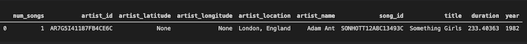
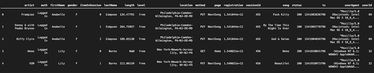

# Project: Data Warehouse with Amazon Redshift

## Introduction
A music streaming startup, Sparkify, has grown their user base and song database and want to move their processes and data onto the cloud. Their data resides in S3, in a directory of JSON logs on user activity on the app, as well as a directory with JSON metadata on the songs in their app.

As their data engineer, I am tasked with building an ETL pipeline that extracts their data from S3, stages them in Redshift, and transforms data into a set of dimensional tables for their analytics team to continue finding insights in what songs their users are listening to. The analytics team from Sparkify will provide me with queries to run on the ETL pipeline which will be compared with their expected results.

## Project Description
This project's goal is to build an ETL pipeline for a database hosted on Redshift. The process is as follows:
1) load data from S3 to staging tables on Redshift
2) execute SQL statements that create the analytics tables from these staging tables

## Dataset
There are two data sets sources that are being used in this project: 
1) [Million Song Dataset](https://labrosa.ee.columbia.edu/millionsong/)
2) [Event Simulator](https://github.com/Interana/eventsim)

### Song Dataset
The first dataset is a subset (~17,000 files) of real data from the Million Song Dataset. Each file is in JSON format and contains metadata about a song and the artist of that song. The files are partitioned by the first three letters of each song's track ID. For example, here are filepaths to two files in this dataset.

song_data/A/B/C/TRABCEI128F424C983.json
song_data/A/A/B/TRAABJL12903CDCF1A.json
And below is an example of what a single song file looks like.

### Log Dataset
The second dataset consists of (30) log files in JSON format generated by the event simulator based on the songs in the dataset above. These simulate app activity logs from an imaginary music streaming app based on configuration settings.

The log files in the dataset are partitioned by year and month. For example, here are filepaths to two files in this dataset.

log_data/2018/11/2018-11-12-events.json
log_data/2018/11/2018-11-13-events.json
And below is an example of what the data in a log file, 2018-11-12-events.json, looks like.

## Schema for Song Play Analysis
Using the song and event datasets, I created a star schema optimized for queries on song play analysis. This includes the following tables.

#### Fact Table: 
1) songplays - records in event data associated with song plays i.e. records with page NextSong
- songplay_id
- start_time
- user_id
- level
- song_id
- artist_id
- session_id
- location
- user_agent

#### Dimension Tables: 
1) users - users in the app
- user_id
- first_name
- last_name
- gender
- level
2) songs - songs in music database
- song_id
- title
- artist_id
- year
- duration
3) artists - artists in music database
- artist_id
- name
- location
- lattitude
- longitude
4) time - timestamps of records in songplays broken down into specific units
- start_time
- hour
- day
- week
- month
- year
- weekday
